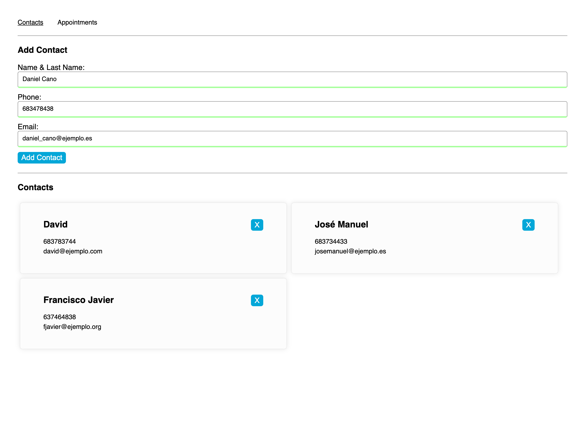

<a id="readme-top"></a>

[](https://app.netlify.com/sites/appointment-cp/deploys)


# &nbsp; Appointment Project 
<br />
<div align="center">
    
</div>
<br />

This project is a React-based web application I developed as part of **Codecademy's Full Stack Engineering course**. The application is designed to manage appointments and contacts, and it provided a hands-on way for me to deepen my understanding of React state management and React Router. Throughout the project, I focused on building a responsive, user-friendly interface and implementing smooth navigation between different sections of the app.

**Link to live project:** <a href="https://appointment-cp.netlify.app/">https://appointment-cp.netlify.app/</a><br/>


<p align="right">(<a href="#readme-top">back to top</a>)</p>

## 📋 &nbsp; Table of Contents

1. [Project Overview](#project-overview)
2. [Features](#features)
3. [Installation](#installation)
4. [Technologies Used](#technologies-used)
5. [Contact](#contact)

<p align="right">(<a href="#readme-top">back to top</a>)</p>


## ✏️ &nbsp; <a id="project-overview">Project Overview</a>

The primary objective of this project was to create a React-based web application that enables users to manage both appointments and contacts. This involves building a user interface and functionality to handle a variety of tasks related to scheduling and contact management.

<p align="right">(<a href="#readme-top">back to top</a>)</p>

## 💿 &nbsp; <a id="features">Features</a>

- **Contact Form:** Provide a form for users to input details about a new contact, including name, phone number and email.
- **Contact List:** Display a list of contacts with details such as name, phone number and email.
- **Appointment Form:** Provide a form for users to input details about a new appointment, including title, contact, date and time.
- **Appointment List:** Display a list of scheduled appointments with details such as title, contact, date and time.
- **Delete Contact:** Enable users to remove contacts from the list
- **Delete Appointment:** Enable users to remove appointments from the list.

<p align="right">(<a href="#readme-top">back to top</a>)</p>

## 🛠️ &nbsp; <a id="installation">Installation</a>

1. Clone the repo:
```bash
git clone https://github.com/JonaRhood/react-appointment-project
```

2. Install NPM packages:
```bash
npm install
```

3. Run the application:
```bash
npm start
```

<p align="right">(<a href="#readme-top">back to top</a>)</p>

## ⚙️ &nbsp; <a id="technologies-used">Technologies Used</a>

* [![REACT][REACT.js]][REACT-url]
* [![REACT ROUTER][REACTROUTER.js]][REACTROUTER-url]
* [![JAVASCRIPT][JAVASCRIPT.js]][JAVASCRIPT-url]
* [![JEST][JEST.js]][JEST-url]
* [![CSS][CSS.js]][CSS-url]
* [![HTML5][HTML5.js]][HTML5-url]
* [![GIT][GIT.js]][GIT-url]

<p align="right">(<a href="#readme-top">back to top</a>)</p>

## 👤 &nbsp; <a id="contact">Contact</a>

<a href="https://github.com/JonaRhood/react-projects/graphs/contributors">
  
</a>

[![LinkedIn][linkedin-shield]][linkedin-url] <br />
Jonathan Cano -  jonathancanofreta@gmail.com

<p align="right">(<a href="#readme-top">back to top</a>)</p>

[product-screenshot]: ./src/resources/img/screen2.png
[linkedin-shield]: https://img.shields.io/badge/-LinkedIn-blue.svg?style=for-the-badge&logo=linkedin&colorBlue
[linkedin-url]: https://www.linkedin.com/in/jonathancanocalduch
[React.js]: https://img.shields.io/badge/React-20232A?style=for-the-badge&logo=react&logoColor=61DAFB
[React-url]: https://reactjs.org/
[Reactrouter.js]: https://img.shields.io/badge/React%20router-20232A?style=for-the-badge&logo=reactrouter&logoColor=white
[Reactrouter-url]: https://reactrouter.com/
[Javascript.js]: https://img.shields.io/badge/Javascript-3b473e?style=for-the-badge&logo=JavaScript&logoColor=Y
[Javascript-url]: https://developer.mozilla.org/es/docs/Web/JavaScript
[Jest.js]: https://img.shields.io/badge/Jest.js-20232A?style=for-the-badge&logo=jest&logoColor=orange
[Jest-url]: https://jestjs.io/
[CSS.js]: https://img.shields.io/badge/CSS3-001569?style=for-the-badge&logo=css3&logoColor=306af1
[CSS-url]: https://developer.mozilla.org/es/docs/Web/CSS
[HTML5.js]: https://img.shields.io/badge/HTML5-2d1f09?style=for-the-badge&logo=html5&logoColor=e8571f
[HTML5-url]: https://developer.mozilla.org/es/docs/Glossary/HTML5
[Git.js]: https://img.shields.io/badge/git-002c05?style=for-the-badge&logo=git&logoColor=e8571f
[Git-url]: https://git-scm.com/
